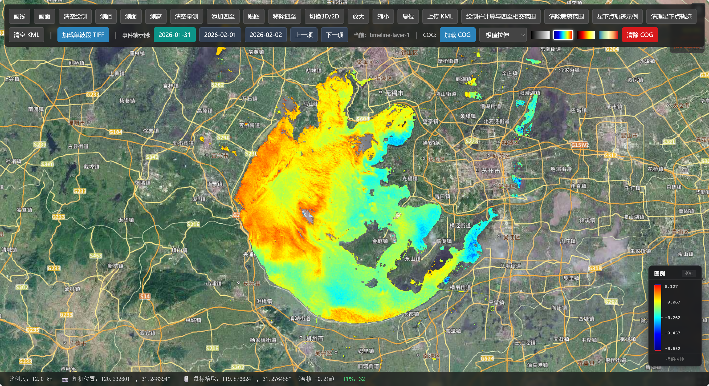

# DataView

基于 **Vue 3 + CesiumJS + TypeScript** 的地理空间数据可视化工具集hooks方式封装，包括绘制标绘、量测分析、遥感影像加载、卫星轨道计算等功能。



## 功能特性

### 地图交互
- **绘制工具** — 线段、多边形交互绘制，输出 WKT 与四至范围
- **量测工具** — 距离、面积、高差测量，支持动态标注
- **地图控制** — 缩放、2D/3D 切换、复位，实时显示比例尺、相机坐标、鼠标拾取坐标与 FPS

### 遥感影像
- **GeoTIFF 加载** — 从 URL 解析 GeoTIFF，WebGL2 着色器高性能渲染，支持大尺寸影像动态下采样
- **COG 瓦片服务** — Cloud Optimized GeoTIFF 按需加载，Worker Pool 多线程并行解码 + GPU 渲染 + LRU 瓦片缓存
- **色带与拉伸** — 灰度 / Jet / Hot / Terrain 四种色带，Min-Max / 标准差 / 百分比三种拉伸模式，实时切换

### 空间分析
- **四至管理** — WKT POLYGON 解析为矩形区域，支持贴图与点击事件
- **WKT 相交分析** — 两个 WKT 几何的相交计算、面积统计与可视化渲染
- **卫星星下点轨迹** — 基于 TLE 两行轨道根数纯前端解算星下点，支持缓冲区分析与过境时间窗口计算

### 图层管理
- **KML / KMZ** — 文件上传解析与加载显示
- **时间轴图层切换** — 按时间轴注册多时相图层，支持上一项 / 下一项切换与飞行定位

## 技术栈

| 类别 | 技术 |
|------|------|
| 框架 | Vue 3 (Composition API) |
| 语言 | TypeScript |
| 三维引擎 | CesiumJS |
| UI 组件 | Element Plus |
| 空间计算 | Turf.js |
| 遥感解析 | geotiff.js |

## 项目结构

```
src/
├── components/
│   ├── CesiumViewer.vue        # 主视图组件
│   └── CogLegend.vue           # COG 图例组件
├── hooks/
│   ├── useCesium.ts            # 地图初始化
│   ├── useCesiumBaseMap.ts     # 底图管理
│   ├── useCesiumControls.ts    # 地图控制 & 状态信息
│   ├── useCesiumDraw.ts        # 交互绘制
│   ├── useCesiumMeasure.ts     # 量测工具
│   ├── useCesiumBoundingBox.ts # 四至矩形管理
│   ├── useCesiumGeoTiff.ts     # GeoTIFF WebGL 渲染
│   ├── useCogTif.ts            # COG Worker Pool 渲染
│   ├── useCesiumkml.ts         # KML/KMZ 加载
│   ├── useCesiumLayer.ts       # 图层管理
│   ├── useCesiumTimelineLayerSwitch.ts  # 时间轴图层切换
│   ├── useWktIntersection.ts   # WKT 相交分析
│   ├── useNadirPointDir.ts     # 星下点轨道计算 (TLE)
│   └── useNadirAreaTrackAnalysis.ts  # 卫星区域过境分析
├── workers/
│   ├── cogRenderWorker.ts      # COG 瓦片解码 Worker
│   └── gpuTileRenderer.ts      # GPU 瓦片渲染器
├── styles/themes/              # 主题样式
└── main.ts                     # 应用入口
```

## 快速开始

### 环境要求

- Node.js >= 18
- pnpm (推荐)

### 安装与运行

```bash
# 安装依赖
pnpm install

# 启动开发服务器
pnpm dev

# 构建生产版本
pnpm build

# 预览构建产物
pnpm preview
```

## 架构设计

项目采用 **Vue Composition API Hooks** 模式，每个功能封装为独立的 `use*` 组合式函数，通过 `getViewer()` 注入 Cesium Viewer 实例，实现功能解耦与按需组合。

```typescript
// 使用示例
const { getViewer, initmap, destroyCesium } = useCesium()
const drawTools = useCesiumDraw(getViewer)
const measureTools = useCesiumMeasure(getViewer)
const cogTools = useCogTif(getViewer)

// 交互绘制
const result = await drawTools.drawPolygon()
console.log(result.wkt) // POLYGON((...))

// 加载 COG
await cogTools.addCogLayer('layer-1', 'https://example.com/data.tif', {
  colormap: 'jet',
  stretch: 'stddev',
  flyTo: true
})
```

### COG 渲染架构

COG 模块最新优化 Worker Pool + GPU 渲染的高性能架构：

```
Main Thread                       Worker Pool (N Workers)
────────────                      ────────────────────────
CogImageryProvider                GeoTIFF.fromUrl / readRasters
  ├─ LRU 缓存 (ImageBitmap)      GPU 像素渲染 (OffscreenCanvas + WebGL2)
  ├─ 请求取消 (epoch 版本号)       CPU Fallback (LUT / RGB)
  ├─ Canvas 对象池                        ↓
  └─ Cesium 集成              ──→ ImageBitmap (zero-copy transfer)
```


